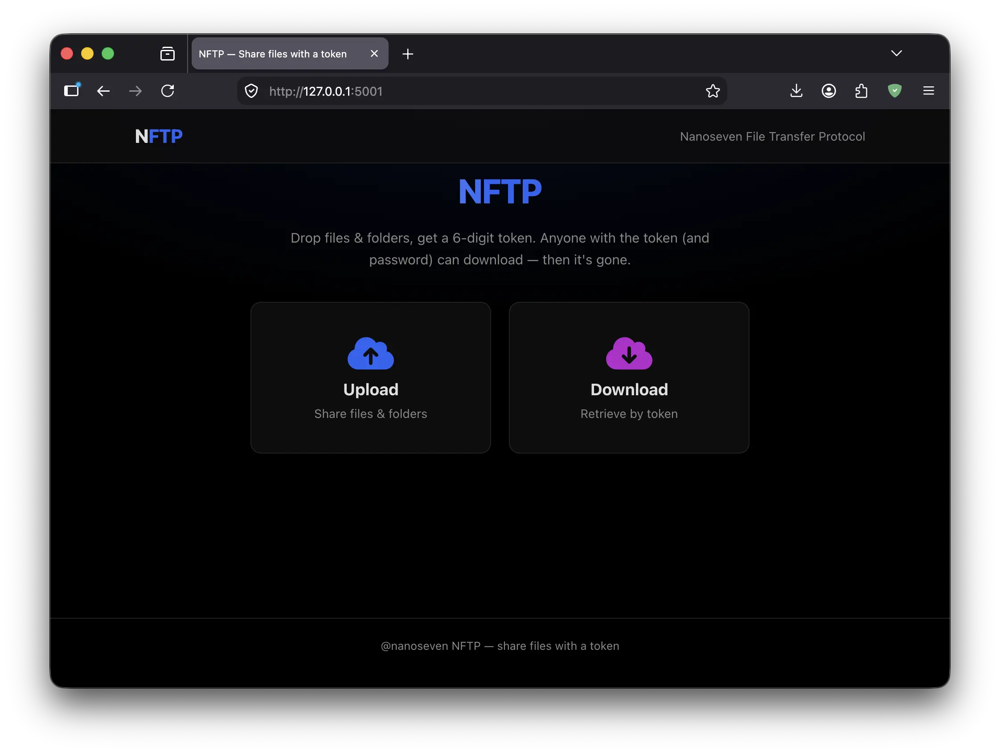
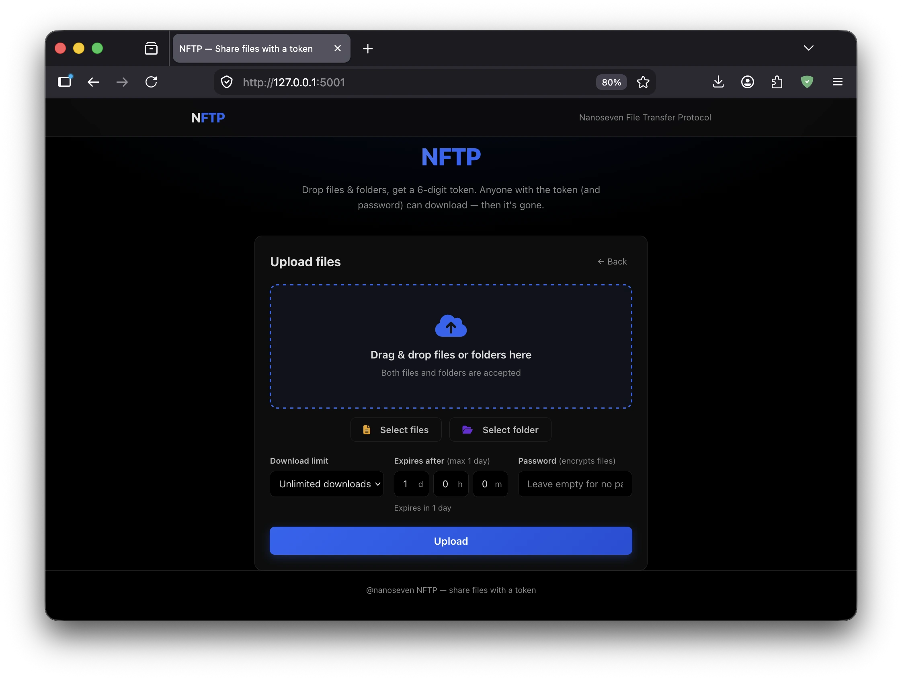
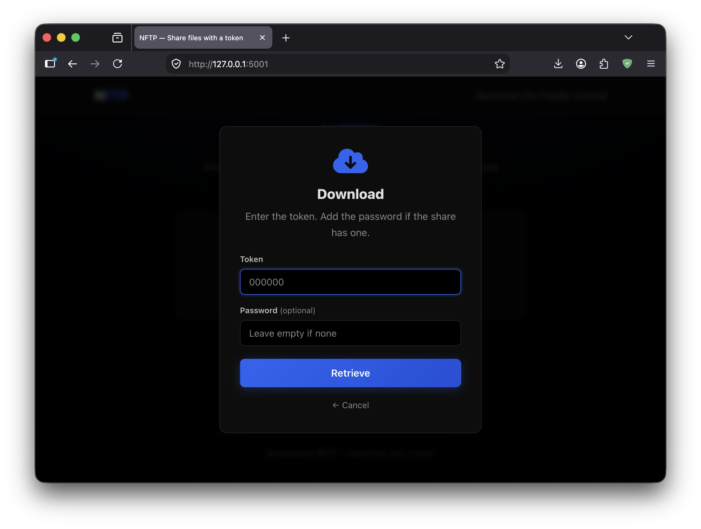

# NanoShare

Share files anywhere, anytime, using just a **6-digit token**. No accounts, no login, no third-party services.

A professor or student uploads a file, gets a token (and an optional password), and shares those credentials. Anyone can download the file by entering the token. When the download limit is reached or the share expires, the file is **deleted automatically**.

Built with Python Flask and SQLite — modular, simple, and easy to debug.

---

## Features

- **Token-based sharing** — 6-digit token, sequential and reused efficiently (000001, 000002, ...).
- **Optional password / encryption** — set a password and files are **encrypted at rest** with the password as the key (PBKDF2 + HMAC). Leave it empty for a plain, token-only share.
- **Download limits**
  - Unlimited downloads (until expiry)
  - 1 download only
  - 5 downloads only
- **Auto-delete** — when the limit is reached or the share expires, the file and metadata are removed and the token is freed for reuse.
- **Drag & drop upload** — files and folders can be mixed in a single upload, with separate "Select files" / "Select folder" buttons.
- **No file type restrictions** — any file, any extension.
- **Expiry control** — set days / hours / minutes with number inputs (default 1 day, max 1 day).
- **No user accounts** — upload and download without signing in.

## Installation

```bash
pip install -r requirements.txt
```

## Running locally

```bash
python app.py
```

Then open http://localhost:5001

The SQLite database is created automatically at `instance/nanoshare.db` on first run.

## Environment variables

All configuration lives in `.env` (copy from `.env.example`). Everything has a sensible default.

| Variable              | Default                          | Description                        |
|-----------------------|----------------------------------|------------------------------------|
| `SECRET_KEY`          | `dev-secret-key-change-me`       | Flask session secret. Set in prod. |
| `DATABASE_URL`        | `sqlite:///nanoshare.db`         | SQLAlchemy database URI            |
| `UPLOAD_DIR`          | `uploads/`                       | Folder where uploaded files live   |
| `MAX_CONTENT_LENGTH`  | `209715200` (200 MB)             | Max upload size in bytes           |

---

## Working Snapshots







---

